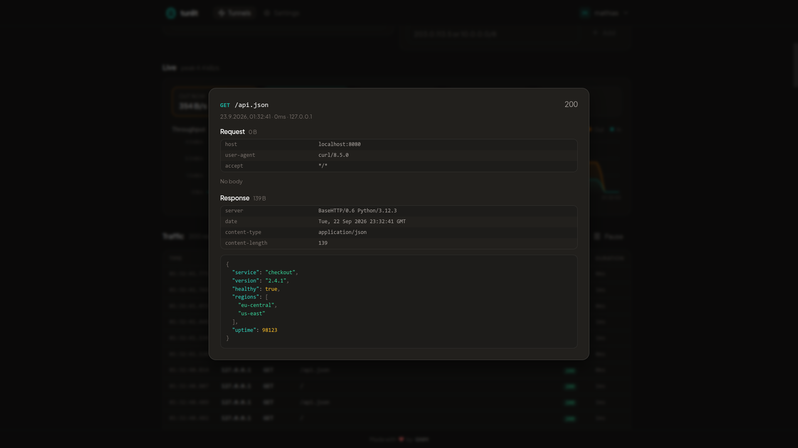
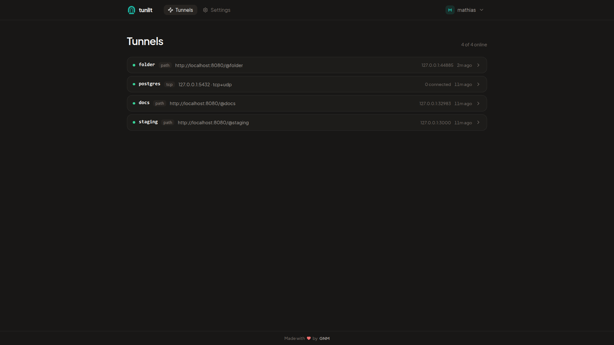
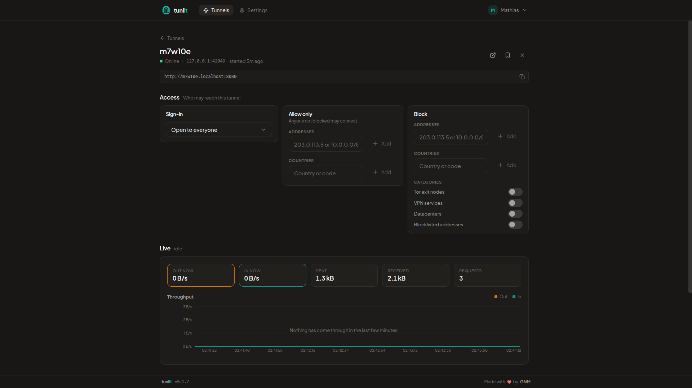
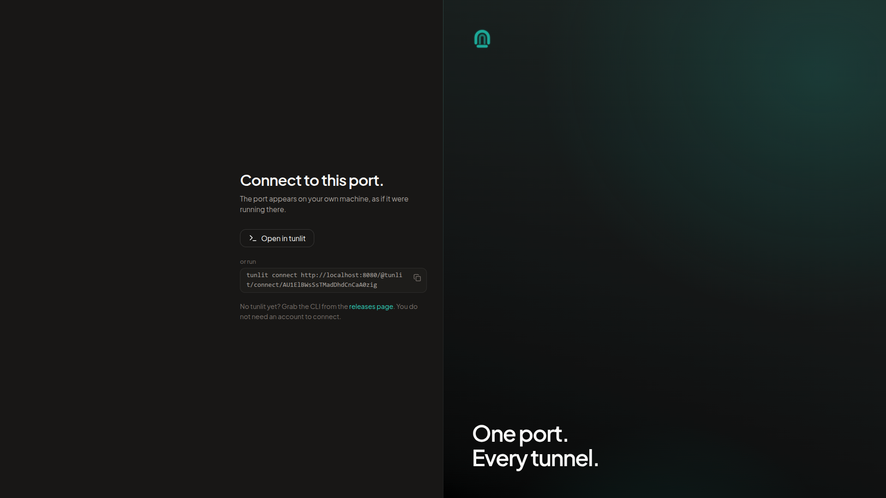

[![Stargazers][stars-shield]][stars-url]
[![Forks][forks-shield]][forks-url]
[![Issues][issues-shield]][issues-url]
[![Contributors][contributors-shield]][contributors-url]
[![MIT License][license-shield]][license-url]
[![Release][release-shield]][release-url]

<br />

<h1 align="center">
  <picture>
    <source media="(prefers-color-scheme: dark)" srcset="docs/public/wordmark-dark.png">
    
  </picture>
</h1>

<p align="center">
  tunlit (short for "tunnel it", pronounced /ˈtʌn.lɪt/) is a self-hosted alternative to ngrok.<br />
  Expose a local port to the internet on your own server, and share it with whoever needs it.
</p>

<p align="center">
  <a href="https://docs.tunlit.dev">Documentation</a>
</p>



## What it does

- **HTTP tunnels** with a public URL, either `https://<id>.example.com` or `https://example.com/@<id>`
- **TCP and UDP tunnels** for anything that is not HTTP, like a database or a game server
- **Share a port** with someone who has no account: they get a link, the port appears on their machine
- **Live traffic** per tunnel, with request and response bodies you can read, edit and replay in the browser
- **Breakpoints** that hold a request or response until you continue, edit or drop it
- **Visitors** grouped by address with country, network, request and blocked counts
- **IP intelligence** for every visitor: country, network, Tor, VPN and datacenter flags, all looked up offline
- **Bad network on demand**: add latency, jitter, a bandwidth cap or packet loss to any tunnel to see how your app copes
- **Persistent names** that stay yours, with your own domains on top
- **Route by path**: `/api` to one port, `/docs` to a folder, the rest to your app, all on one tunnel
- **Protect a tunnel** with a password, a tunlit account, or allow and block rules by address, country, Tor, VPN and datacenter
- **Accounts** for your team, with TOTP, passkeys and OIDC single sign-on
- **HTTPS** either behind your own proxy or with certificates tunlit gets from Let's Encrypt itself

## Install the server

```sh
docker run -d \
  --name tunlit \
  --restart always \
  -p 127.0.0.1:8080:8080 \
  -v tunlit-data:/app/data \
  -e TUNLIT_BASE_DOMAIN=tunlit.example.com \
  -e TUNLIT_PUBLIC_URL=https://tunlit.example.com \
  -e TUNLIT_TRUST_PROXY=true \
  germannewsmaker/tunlit:latest
```

Open `https://tunlit.example.com/@tunlit` and the setup wizard takes it from there.

## Install the CLI

```sh
# Debian, Ubuntu
curl -fsSL https://packages.buildkite.com/tunlit/apt/gpgkey | sudo gpg --dearmor -o /usr/share/keyrings/tunlit.gpg
echo "deb [signed-by=/usr/share/keyrings/tunlit.gpg] https://packages.buildkite.com/tunlit/apt/any/ any main" | sudo tee /etc/apt/sources.list.d/tunlit.list
sudo apt update && sudo apt install tunlit-cli
```

Windows has an [installer](https://github.com/gnmyt/tunlit/releases/latest/download/tunlit-x64.msi), Fedora and
RHEL have an rpm repository, and macOS has a plain binary. All of it is in
[Installation](https://docs.tunlit.dev/installation).

## Use it

```sh
curl -fsSL https://tunlit.dev/install | sh
tunlit login                 # link this machine to your server, once
tunlit http 3000             # share a local port
tunlit http ./dist           # or a folder, with a built-in file server
tunlit tcp 5432              # share a database, or anything else that is not HTTP
```



Each tunnel has its access rules and live throughput on one page.



A `tunlit tcp` tunnel gets a share code. Whoever you send it to opens the link and gets the port on their own
machine, without an account.



## Documentation

- [Installation](https://docs.tunlit.dev/installation)
- [Configuration](https://docs.tunlit.dev/configuration)
- [HTTPS](https://docs.tunlit.dev/https)
- [Reverse proxy](https://docs.tunlit.dev/reverse-proxy)
- [CLI](https://docs.tunlit.dev/cli)

## License

[MIT](LICENSE)

[stars-shield]: https://img.shields.io/github/stars/gnmyt/tunlit.svg?style=for-the-badge
[stars-url]: https://github.com/gnmyt/tunlit/stargazers
[forks-shield]: https://img.shields.io/github/forks/gnmyt/tunlit.svg?style=for-the-badge
[forks-url]: https://github.com/gnmyt/tunlit/network/members
[issues-shield]: https://img.shields.io/github/issues/gnmyt/tunlit.svg?style=for-the-badge
[issues-url]: https://github.com/gnmyt/tunlit/issues
[contributors-shield]: https://img.shields.io/github/contributors/gnmyt/tunlit.svg?style=for-the-badge
[contributors-url]: https://github.com/gnmyt/tunlit/graphs/contributors
[license-shield]: https://img.shields.io/github/license/gnmyt/tunlit.svg?style=for-the-badge
[license-url]: https://github.com/gnmyt/tunlit/blob/main/LICENSE
[release-shield]: https://img.shields.io/github/v/release/gnmyt/tunlit.svg?style=for-the-badge
[release-url]: https://github.com/gnmyt/tunlit/releases/latest
