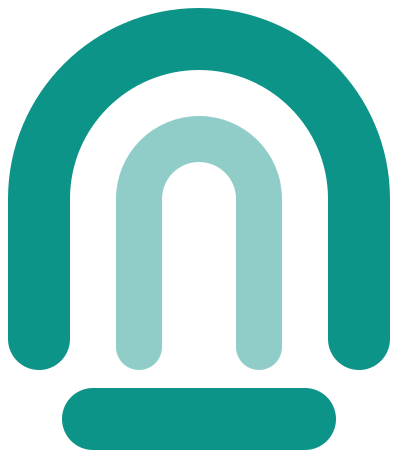

[![Stargazers][stars-shield]][stars-url]
[![Forks][forks-shield]][forks-url]
[![Issues][issues-shield]][issues-url]
[![Contributors][contributors-shield]][contributors-url]
[![MIT License][license-shield]][license-url]
[![Release][release-shield]][release-url]

 

<h1 align="center">
  &nbsp;tunlit
</h1>

tunlit (short for "tunnel it", pronounced /ˈtʌn.lɪt/) is a self-hosted alternative to ngrok.
It lets you expose your local server to the internet, and lets you share it with others.

## License

[MIT](LICENSE)

[stars-shield]: https://img.shields.io/github/stars/gnmyt/tunlit.svg?style=for-the-badge
[stars-url]: https://github.com/gnmyt/tunlit/stargazers
[forks-shield]: https://img.shields.io/github/forks/gnmyt/tunlit.svg?style=for-the-badge
[forks-url]: https://github.com/gnmyt/tunlit/network/members
[issues-shield]: https://img.shields.io/github/issues/gnmyt/tunlit.svg?style=for-the-badge
[issues-url]: https://github.com/gnmyt/tunlit/issues
[contributors-shield]: https://img.shields.io/github/contributors/gnmyt/tunlit.svg?style=for-the-badge
[contributors-url]: https://github.com/gnmyt/tunlit/graphs/contributors
[license-shield]: https://img.shields.io/github/license/gnmyt/tunlit.svg?style=for-the-badge
[license-url]: https://github.com/gnmyt/tunlit/blob/main/LICENSE
[release-shield]: https://img.shields.io/github/v/release/gnmyt/tunlit.svg?style=for-the-badge
[release-url]: https://github.com/gnmyt/tunlit/releases/latest
